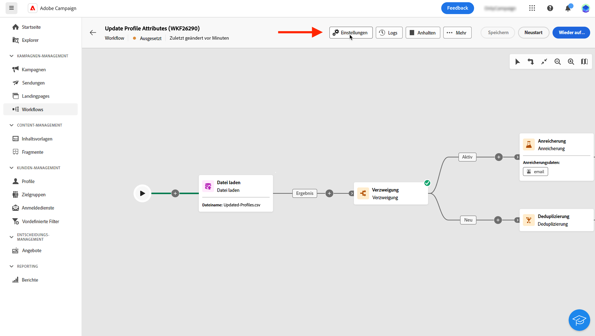

# Konfigurieren von Workflow-Einstellungen {#workflow-settings}

>[!CONTEXTUALHELP]
>id="acw_workflow_creation_properties"
>title="Workflow-Eigenschaften"
>abstract="Wählen Sie in diesem Bildschirm die Vorlage aus, die zum Erstellen des Workflows verwendet werden soll, und geben Sie einen Titel an. Erweitern Sie den Abschnitt **Zusätzliche Optionen**, um weitere Einstellungen wie den internen Namen des Workflows, seine Ordner, die Zeitzone und die Gruppe der Verantwortlichen zu konfigurieren. Es wird dringend empfohlen, eine Gruppe von Verantwortlichen auszuwählen, damit Benutzerinnen und Benutzer benachrichtigt werden, wenn Fehler auftreten."

Bei der Erstellung eines Workflows oder der Orchestrierung von Workflow-Aktivitäten auf der Arbeitsfläche haben Sie Zugriff auf erweiterte Einstellungen, die sich auf den Workflow beziehen. Sie können beispielsweise eine bestimmte Zeitzone für den Workflow festlegen, verwalten, wie sich der Workflow im Fehlerfall verhält, oder die Verzögerung verwalten, nach der der Workflow-Verlauf bereinigt werden soll.

Diese Einstellungen sind in der bei der Workflow-Erstellung ausgewählten Vorlage vorkonfiguriert, können aber bei Bedarf für diesen spezifischen Workflow bearbeitet werden.

{zoomable=&quot;yes&quot;}{width="70%" align="left"}

## Workflow-Eigenschaften  {#properties}

>[!CONTEXTUALHELP]
>id="acw_workflow_settings_properties"
>title="Workflow-Eigenschaften "
>abstract="Dieser Abschnitt enthält allgemeine Workflow-Eigenschaften, auf die auch beim Erstellen des Workflows zugegriffen werden kann. Sie können die Vorlage auswählen, die zum Erstellen des Workflows verwendet werden soll, und einen Titel angeben. Erweitern Sie den Abschnitt „zusätzliche Optionen“, um bestimmte Einstellungen zu konfigurieren, z. B. den Ordner, in dem der Workflow gespeichert wird, oder die Zeitzone."

Die **[!UICONTROL Eigenschaften]** enthält allgemeine Einstellungen, die beim Erstellen eines Workflows konfiguriert werden können. Um auf die Eigenschaften eines vorhandenen Workflows zuzugreifen, klicken Sie auf die Schaltfläche **[!UICONTROL Einstellungen]** in der Aktionsleiste über der Arbeitsfläche des Workflows verfügbar.

{zoomable=&quot;yes&quot;}{width="70%" align="left"}

Diese Eigenschaften sind:

* Der **[!UICONTROL Titel]** des Workflows, der in der Liste angezeigt wird.
* Der **[!UICONTROL interne Name]** des Workflows.
* Der **[!UICONTROL Ordner]**, in dem der Workflow gespeichert werden soll.
* Die Standard-**[!UICONTROL Zeitzone]**, die in allen Workflow-Aktivitäten zu verwenden ist. Standardmäßig ist die Zeitzone des Workflows die für die aktuelle Campaign-Benutzerin bzw. den aktuellen Campaign-Benutzer definierte Zeitzone.
Mögliche Werte:
   * **Server-Zeitzone**, um die Zeitzone des Anwendungs-Servers von Adobe Campaign zu verwenden
   * **Benutzer-Zeitzone**, um die Zeitzone der Benutzerin bzw. des Benutzers von Adobe Campaign zu verwenden, die bzw. der den Workflow entsprechend der Definition im Benutzerprofil in der Client-Konsole ausführt.
   * **Zeitzone der Datenbank**, um die Zeitzone des Datenbank-Servers zu verwenden.
   * Eine bestimmte Zeitzone
* Wenn ein Workflow fehlschlägt, werden die Benutzenden der im Feld **[!UICONTROL Verantwortliche(r)]** ausgewählten Benutzergruppe per E-Mail benachrichtigt.
* Sie können auch eine **[!UICONTROL Beschreibung]** Ihres Workflows eingeben.

Wenn der Workflow [mit einer Kampagne verknüpft](create-workflow.md) ist, wird dies im Feld **[!UICONTROL Verknüpfte Kampagne]** angezeigt. Sie können die zugehörige Kampagne über dieses Feld öffnen.

## Segmentierungseinstellungen  {#segmentation-settings}

>[!CONTEXTUALHELP]
>id="acw_workflow_settings_segmentation"
>title="Segmentierungseinstellungen"
>abstract="In diesem Bereich können Sie die Zielgruppendimension auswählen, um Profile im Workflow auszuwählen, und entscheiden, ob die Workflow-Ergebnisse zwischen zwei Ausführungen beibehalten werden sollen. Diese Option sollte nur zu Testzwecken verwendet werden und darf in einem Produktions-Workflow nie aktiviert werden."

* **[!UICONTROL Zielgruppendimension]**: Wählen Sie die Zielgruppendimension aus, die für die Zielauswahl von Profilen, Empfängerinnen und Empfängern, Vertragsbegünstigten, Benutzerinnen und Benutzern, Abonnierenden, usw. verwendet werden soll. [Erfahren Sie mehr über Zielgruppendimensionen](../audience/targeting-dimensions.md)

* **[!UICONTROL Zwischen zwei Ausführungen die ermittelte Population festhalten]**: Standardmäßig werden nur die Arbeitstabellen der letzten Ausführung des Workflows beibehalten. Arbeitstabellen früherer Ausführungen werden durch einen technischen Workflow bereinigt, der täglich ausgeführt wird.

  Wenn diese Option aktiviert ist, werden Arbeitstabellen auch nach Ausführung des Workflows beibehalten. Sie können sie zu Testzwecken verwenden; daher darf sie **nur** in Entwicklungs- oder Staging-Umgebungen genutzt werden. Sie darf niemals in einem Produktions-Workflow aktiviert sein.

## Ausführungsparameter  {#exec-settings}

>[!CONTEXTUALHELP]
>id="acw_workflow_settings_execution"
>title="Ausführungsparameter"
>abstract="In diesem Abschnitt können Sie Einstellungen für die Ausführung des Workflows konfigurieren, z. B. für wie viele Tage der Workflow-Verlauf gespeichert wird."

* **[!UICONTROL Verlauf in Tagen]**: Gibt die Anzahl der Tage an, nach denen der Verlauf bereinigt werden muss. Der Verlauf enthält Elemente im Zusammenhang mit dem Workflow: Protokolle, Aufgaben, Ereignisse (technische Objekte, die mit dem Workflow-Vorgang verknüpft sind). Der Standardwert bei vordefinierten Workflow-Vorlagen beträgt 30 Tage. Die Bereinigung des Verlaufs erfolgt durch den technischen Workflow für die Datenbankbereinigung, der standardmäßig täglich ausgeführt wird.

  >[!IMPORTANT]
  >
  >Wenn das Feld **[!UICONTROL Verlauf in Tagen]** leer gelassen wird, wird sein Wert als „1“ betrachtet; der Verlauf wird also nach einem Tag bereinigt.

* **[!UICONTROL Standardaffinität]**: Wenn Ihre Installation mehrere Workflow-Server umfasst, wählen Sie in diesem Feld den Computer aus, auf dem der Workflow ausgeführt werden soll. Dies erzwingt die Ausführung dieses Workflows auf einem bestimmten Server. Sie können einen beliebigen vorhandenen Affinitätsnamen auswählen. Stellen Sie jedoch sicher, dass Sie keine Leerzeichen oder Satzzeichen verwenden. Wenn Sie verschiedene Server verwenden, geben Sie unterschiedliche Namen an, getrennt durch Kommas.

  >[!IMPORTANT]
  >
  >Wenn der in diesem Feld definierte Wert auf keinem Server vorhanden ist, bleibt der Workflow ausstehend.

* **[!UICONTROL SQL-Abfragen im Protokoll speichern]**: Mit dieser Option können Sie die SQL-Abfragen aus dem Workflow in den Protokollen speichern. Diese Funktion ist erfahrenen Benutzerinnen und Benutzern vorbehalten. Sie gilt für Workflows, die Zielgruppenbestimmungsaktivitäten enthalten, wie **[!UICONTROL Zielgruppe aufbauen]**. Wenn diese Option aktiviert ist, werden die während der Workflow-Ausführung an die Datenbank gesendeten SQL-Abfragen in den Protokollen des Workflows angezeigt, sodass Sie sie analysieren können, um Abfragen zu optimieren oder Probleme zu diagnostizieren.

## Einstellungen für den Umgang mit Fehlern  {#error-settings}

>[!CONTEXTUALHELP]
>id="acw_workflow_settings_error"
>title="Einstellungen für den Umgang mit Fehlern"
>abstract="In diesem Abschnitt können Sie definieren, wie der Workflow mit Fehlern während seiner Ausführung umgehen soll. Sie können festlegen, dass der Prozess angehalten werden soll, dass eine bestimmte Anzahl von Fehlern ignoriert werden soll oder dass die Ausführung des Workflows gestoppt werden soll."

* **[!UICONTROL Umgang mit Fehlern]**: In diesem Feld können Sie festlegen, welche Aktionen ausgeführt werden sollen, wenn eine Workflow-Aufgabe Fehler aufweist. Es gibt drei mögliche Optionen:

   * **[!UICONTROL Prozess aussetzen]**: Der Workflow wird automatisch ausgesetzt und der Status wechselt zu **[!UICONTROL Fehlgeschlagen]**. Sobald das Problem behoben ist, setzen Sie den Workflow mit der Schaltfläche **[!UICONTROL Fortsetzen]** fort.
   * **[!UICONTROL Ignorieren]**: Der Status der Aufgabe, die den Fehler ausgelöst hat, ändert sich in **[!UICONTROL Fehlgeschlagen]**, der Workflow behält jedoch den Status **[!UICONTROL Gestartet]**. <!-- TO ADD ONCE SCHEUDLER IS AVAILABLE This configuration is relevant for recurring tasks: if the branch includes a scheduler, it will start normally next time the workflow is executed.-->
   * **[!UICONTROL Vorgang abbrechen]**: Der Workflow wird automatisch angehalten und der Status ändert sich in **[!UICONTROL Fehlgeschlagen]**. Sobald das Problem behoben ist, starten Sie den Workflow mit der Schaltfläche **[!UICONTROL Starten]** erneut.

* **[!UICONTROL Aufeinanderfolgende Fehler]**: Dieses Feld wird verfügbar, wenn im Feld **[!UICONTROL Im Fehlerfall]** der Wert **[!UICONTROL Ignorieren]** ausgewählt wurde. Sie können die Anzahl der Fehler angeben, die ignoriert werden können, bevor der Prozess angehalten wird. Sobald diese Zahl erreicht ist, wechselt der Workflow-Status zu **[!UICONTROL Fehlgeschlagen]**. Wenn der Wert dieses Felds 0 beträgt, wird der Workflow unabhängig von der Fehleranzahl nie angehalten.
