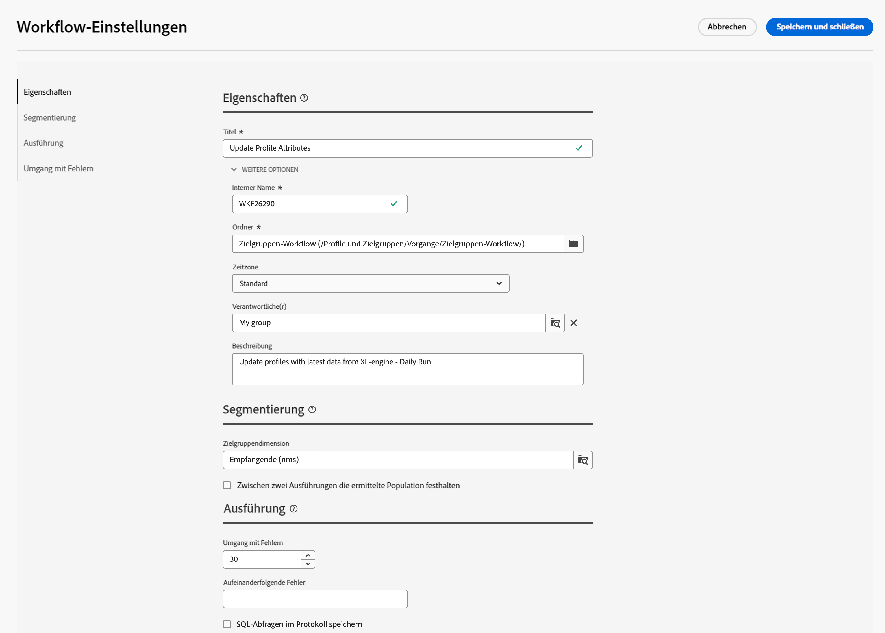

# Konfigurieren von Workflow-Einstellungen {#workflow-settings}

Bei der Orchestrierung von Workflow-Aktivitäten auf der Arbeitsfläche können Sie auf erweiterte Einstellungen im Zusammenhang mit dem Workflow zugreifen. Sie können beispielsweise eine bestimmte Zeitzone für den Workflow festlegen, verwalten, wie sich der Workflow im Fehlerfall verhält, oder die Verzögerung verwalten, nach der der Workflow-Verlauf bereinigt werden soll.

Diese Einstellungen sind in der bei der Workflow-Erstellung ausgewählten Vorlage vorkonfiguriert, können aber bei Bedarf für diesen spezifischen Workflow bearbeitet werden.

Klicken Sie dazu auf die Schaltfläche **[!UICONTROL Workflow-Einstellungen]** in der linken oberen Ecke der Arbeitsfläche neben der Workflow-Beschriftung.

## Workflow-Eigenschaften  {#properties}

>[!CONTEXTUALHELP]
>id="acw_workflow_settings_properties"
>title="Workflow-Eigenschaften"
>abstract="Noch nicht definiert"

Die **[!UICONTROL Eigenschaften]** enthält allgemeine Einstellungen, auf die auch bei der Erstellung des Workflows zugegriffen werden kann.

* **[!UICONTROL Titel]**: Der Titel des Workflows, der in der Liste angezeigt wird.
* **[!UICONTROL Name]**: Interner Name des Workflows.
* **[!UICONTROL Ordner]**: Der Ordner, in dem der Workflow gespeichert werden soll.
* **[!UICONTROL Verknüpfte Kampagne]**: Dieses Feld wird angezeigt, wenn der Workflow innerhalb einer Kampagne erstellt wurde. Damit können Sie die zugehörige Kampagne öffnen.
* **[!UICONTROL Zeitzone]**: Definieren Sie eine bestimmte Zeitzone, die standardmäßig in allen Workflow-Aktivitäten verwendet werden soll. Standardmäßig ist die Zeitzone des Workflows die für den aktuellen Campaign-Benutzer bzw. die aktuelle Campaign-Benutzerin definierte Zeitzone.
* **[!UICONTROL Supervisor(en)]**: Wenn ein Workflow fehlerhaft ist, werden die zur Workflow-Überwachungsgruppe gehörenden Benutzer per E-Mail benachrichtigt, sofern ihre E-Mail-Adresse in ihrem Profil angegeben ist.
* **[!UICONTROL Beschreibung]**: Verwenden Sie dieses Feld, um eine Beschreibung Ihres Workflows anzugeben.

## Segmentierungseinstellungen

>[!CONTEXTUALHELP]
>id="acw_workflow_settings_segmentation"
>title="Segmentierungseinstellungen"
>abstract="Noch nicht definiert"

* **[!UICONTROL Zielgruppendimension]**: Wählen Sie die Zielgruppendimension aus, die für die Zielgruppenbestimmung von Profilen verwendet werden soll: Empfänger, Empfänger, Betreiber, Abonnenten usw.
* **[!UICONTROL Zwischen zwei Ausführungen die ermittelte Population festhalten]**: Standardmäßig werden nur die Arbeitstabellen der letzten Ausführung des Workflows beibehalten. Arbeitstabellen früherer Ausführungen werden durch einen technischen Workflow bereinigt, der täglich ausgeführt wird.

   Wenn diese Option aktiviert ist, werden Arbeitstabellen auch nach Ausführung des Workflows beibehalten. Sie können sie zu Testzwecken verwenden und dürfen daher nur in Entwicklungs- oder Staging-Umgebungen verwendet werden. Sie darf nie in einem Produktions-Workflow überprüft werden.

## Ausführungsparameter

>[!CONTEXTUALHELP]
>id="acw_workflow_settings_execution"
>title="Ausführungseinstellungen"
>abstract="Noch nicht definiert"

* **[!UICONTROL Verlauf in Tagen]**: Gibt die Anzahl der Tage an, nach denen der Verlauf bereinigt werden muss. Der Verlauf enthält Elemente im Zusammenhang mit dem Workflow: Protokolle, Aufgaben, Ereignisse (technische Objekte, die mit dem Workflow-Vorgang verknüpft sind). Der Standardwert bei nativen Workflow-Vorlagen beträgt 30 Tage. Die Bereinigung des Verlaufs erfolgt durch den technischen Workflow für die Datenbankbereinigung, der standardmäßig täglich ausgeführt wird.

   >[!IMPORTANT]
   >
   >Wenn das Feld **[!UICONTROL Verlauf in Tagen]** leer gelassen wird, wird sein Wert als „1“ betrachtet; der Verlauf wird also nach einem Tag bereinigt.

* **[!UICONTROL Standardaffinität]**: Wenn Ihre Installation mehrere Workflow-Server umfasst, wählen Sie in diesem Feld den Computer aus, auf dem der Workflow ausgeführt werden soll. Wenn der in diesem Feld definierte Wert auf keinem Server vorhanden ist, bleibt der Workflow ausstehend.

* **[!UICONTROL SQL-Abfragen im Protokoll speichern]**: dient der Speicherung der SQL-Abfragen aus dem Workflow in den Logs. Diese Funktion ist erfahrenen Benutzern vorbehalten. Sie gilt für Workflows, die Zielgruppenbestimmungsaktivitäten enthalten, wie **[!UICONTROL Audience erstellen]**. Wenn diese Option aktiviert ist, werden die während der Workflow-Ausführung an die Datenbank gesendeten SQL-Abfragen in Adobe Campaign angezeigt, sodass Sie sie analysieren können, um Abfragen zu optimieren oder Probleme zu diagnostizieren.

   Abfragen werden in einer **[!UICONTROL SQL-Logs]** -Tab, der zum Workflow (außer Kampagnen-Workflows) und zum **[!UICONTROL Eigenschaften]** Aktivität, wenn die Option aktiviert ist. <!-- where?-->

## Einstellungen für den Umgang mit Fehlern

>[!CONTEXTUALHELP]
>id="acw_workflow_settings_error"
>title="Einstellungen für den Umgang mit Fehlern"
>abstract="Noch nicht definiert"

* **[!UICONTROL Umgang mit Fehlern]**: In diesem Feld können Sie festlegen, welche Aktionen bei einer Workflow-Aufgabe ausgeführt werden sollen. Es gibt zwei Möglichkeiten:

   * **[!UICONTROL Prozess aussetzen]**: Der Workflow wird automatisch ausgesetzt und der Status wechselt zu **[!UICONTROL Fehlgeschlagen]**. Sobald das Problem behoben ist, setzen Sie den Workflow mit dem **[!UICONTROL Fortsetzen]** Schaltflächen.
   * **[!UICONTROL Ignorieren]**: Der Status der Aufgabe, die den Fehler ausgelöst hat, ändert sich in **[!UICONTROL Fehlgeschlagen]**, der Workflow behält jedoch die **[!UICONTROL Gestartet]** Status. <!-- TO ADD ONCE SCHEUDLER IS AVAILABLE This configuration is relevant for recurring tasks: if the branch includes a scheduler, it will start normally next time the workflow is executed.-->
   * **[!UICONTROL Vorgang abbrechen]**: Der Workflow wird automatisch angehalten und der Status ändert sich in **[!UICONTROL Fehlgeschlagen]**. Sobald das Problem behoben ist, starten Sie den Workflow mit dem **[!UICONTROL Starten]** Schaltflächen.

* **[!UICONTROL Folgefehler]**: Dieses Feld wird verfügbar, wenn die Variable **[!UICONTROL Ignorieren]** -Wert in der **[!UICONTROL Bei Fehlern]** -Feld. Sie können die Anzahl der Fehler angeben, die ignoriert werden können, bevor der Prozess angehalten wird. Sobald diese Zahl erreicht ist, wechselt der Workflow-Status zu **[!UICONTROL Fehlgeschlagen]**. Wenn der Wert dieses Felds 0 beträgt, wird der Workflow unabhängig von der Fehleranzahl nie angehalten.
